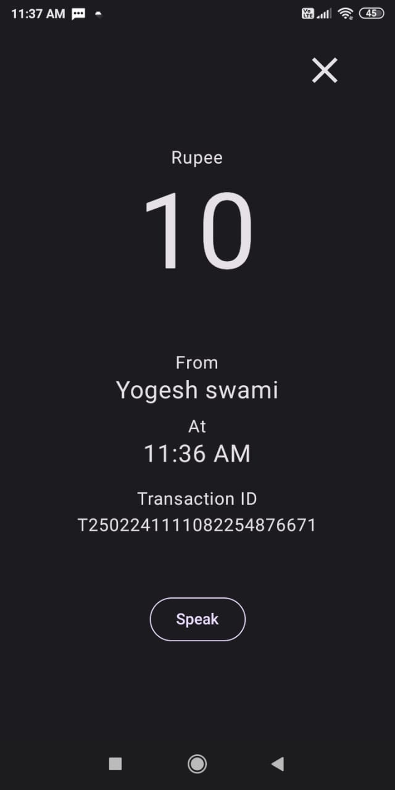
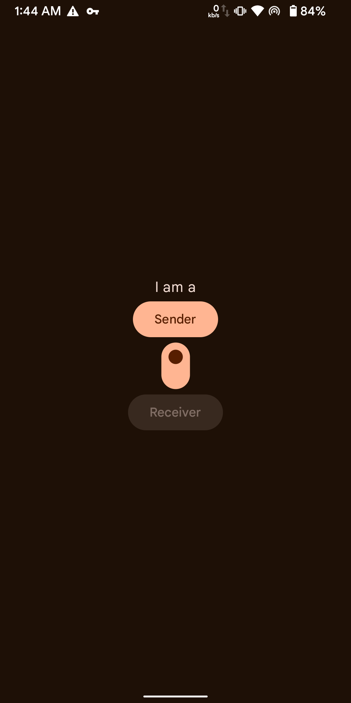
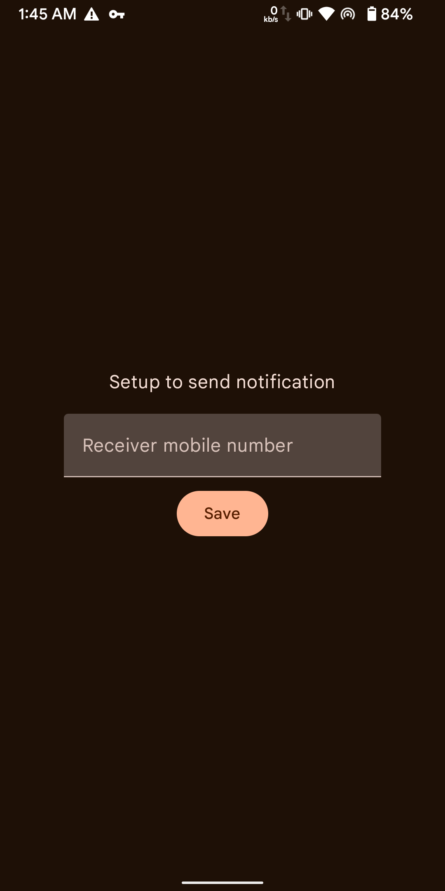
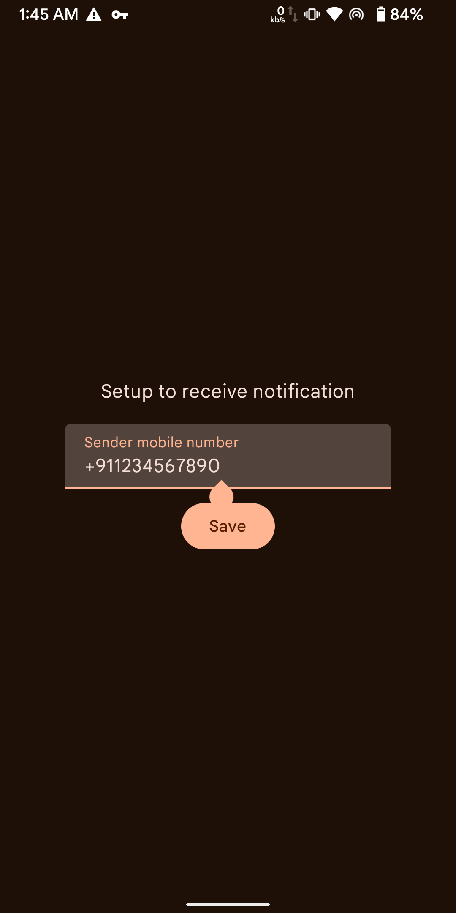
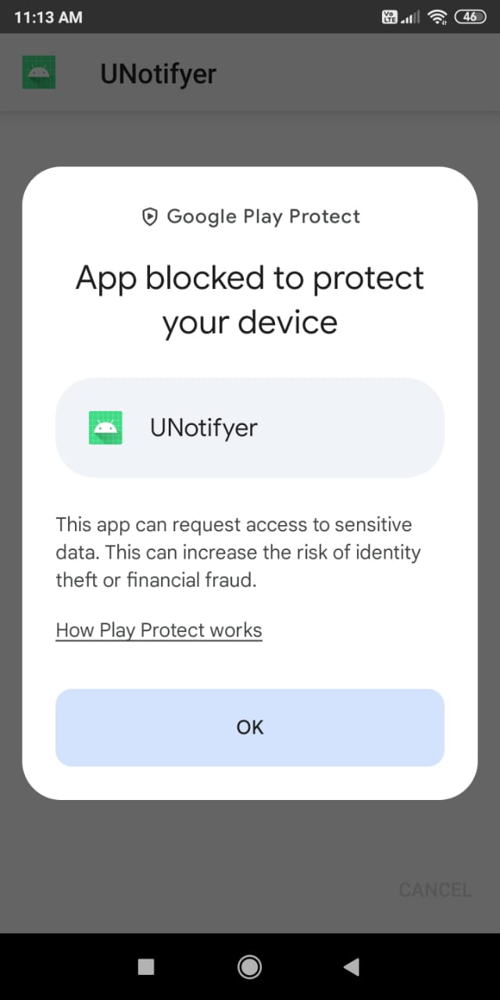
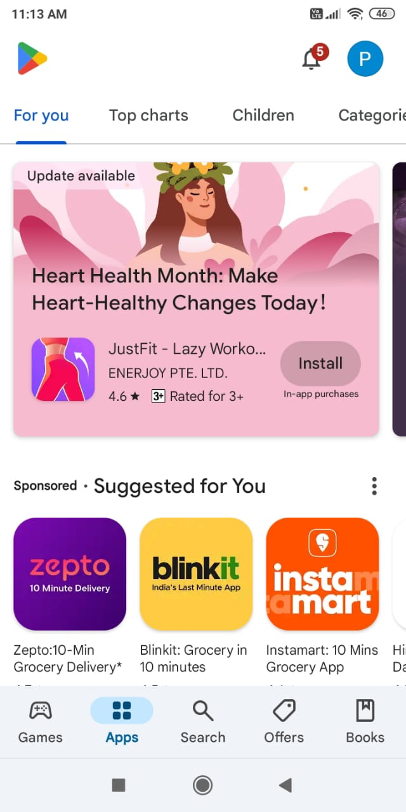
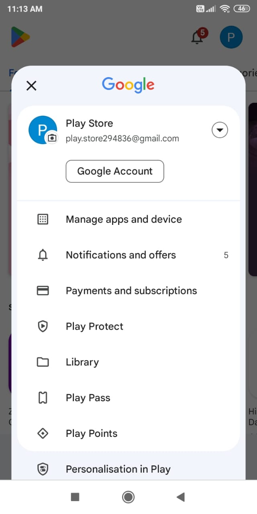
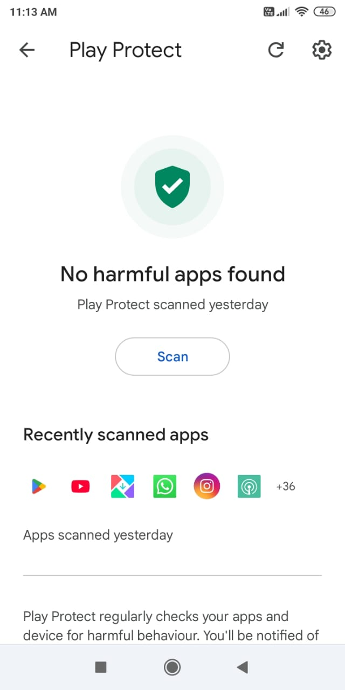
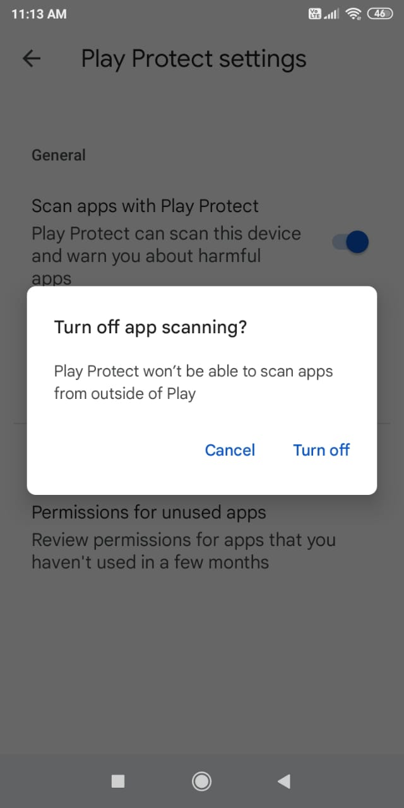

# Payment received view

apk link: [click here](https://github.com/ys-pro-duction/UNotifyer/releases/download/1.1/app-release.apk).

# Flow of app

  
  
  

##### As sender

1. Enter receiver mobile number
2. Now a notification listner activated
3. when get **PhonePe Business** notification
4. read notification
5. if it's payment notification
6. send **SMS** to receiver mobile number

##### As receiver

1. Enter sender mobile number
2. Now a **SMS** listener activated
3. when get a **SMS**
4. if it's from sender number
5. it read payment info and display to lockscreen and show notification of payment

# Install Troubleshooting

* Some time play protect block this app to being install because it's not available on play store.
* here how to fix

  
  
  
  
  

and in some devices you are unable to enable notification access permission
just go to app info and click three on top right corner and allow restricted permission and restart.

### In Xiaomi/Redmi/Mi mobile
in xiaomi device you need to enable to show notification on lock screen
* Click and hold app icon
* click app info
* click notification and enable **Lock screen notifications**
* now click Other permissions and enable **Show on lock screen**
